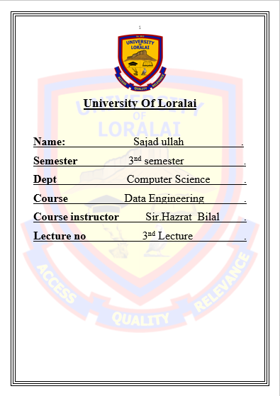

# 3rd Class Tasks. Part A, Part B, part C and part D



*** 
***
***
***
**_**Completed by Sajad ullah **_**\
Email <sajadullah337@gmail.com>\
WhatsApp <https://wa.me/923363765236>\
Portfolio <https://sajad-portfolio.netlify.app/>\
GitHub <https://sajad-ullah.github.com/>\
YouTube <https://youtube-sajad-ullah.com>
*** 
***
***
***

 Respected Sir,

I have completed and executed all the Python questions. The solutions are organized in a Jupyter Notebook with clear Markdown explanations. The .ipynb file has been uploaded to my GitHub for your review: <https://github.com/sajad-ullah/Data_Engineering_Course_By_Sir_Hazrat_Bilal>

Thank you for your guidance.

Sincerely,\
Sajad Ullah 
***
***
***


> **Contents**

- [1- Part A](#1--part-a)
- [2- Part B](#2--part-b)
- [3- Part C](#3--part-c)
- [4- Part D](#4--part-d) 
- [5- Part E](#5--part-e) 
*** 
***
***
***
# _**1- Part A**_
*** 
***
***
***


#### 1. Given `a=10, b=3`, compute `q` (integer division), `r` (remainder), `f` (float division)?
```a = 10 
b = 3 
q = a // b
r = a % b 
f = a / b
print("q=", q)
print("r=", r)
print("f=", f)
```
> Output\
q= 3\
r= 1\
f= 3.3333333333333335

#### 2. Given `x=7`, update `x` to `x+1`, then to `x-2`, then to `x*3`, then to `x/2` (in separate assignments)?

```
x = 7 
x = x + 1
x = x - 2
x = x * 3 
x = x / 2 
print(x)
```
>Output\
9.0


#### 3. Swap `a` and `b` without using a third variable?

```
a = 4 
b = 5 
print("value of a is:" , a)
print("value of b is:" , b)
a = a + b 
b = a - b 
a = a - b

print("value of a is:", a)
print("value of b is:", b)
```
> Output
 value of a is: 4 \
value of b is: 5\
value of a is: 5\
value of b is: 4


#### 4. Given `price=450` and `discount=15` (percent), compute final price after discount?
```
price = 450 
discount = 15  
final_price = price - price * discount / 100 
print("Final price is:",final_price)
```
> Output
Final price is: 382.5


#### 5. Given `seconds=3672`, compute `hours`, `minutes`, `remaining_seconds`.
```
seconds = 3672

hours = seconds // 3600
remaining = seconds % 3600

minutes = remaining // 60
remaining_seconds = remaining % 60

print(hours, ":", minutes, ":", remaining_seconds)
```
> Output
1 : 1 : 12 


#### Q6: Given n = 12345, find last digit and first digit (no loops)

```
n = 12345
last_digit = n % 10
first_digit = n // 10000   # because number has 5 digits

print("Q6:")
print("First Digit:", first_digit)
print("Last Digit:", last_digit)
```
> Output\
First Digit: 1\
Last Digit: 5 

#### Q7: Given length = 12 and width = 8, find area and perimeter?
```
length = 12
width = 8

area = length * width
perimeter = 2 * (length + width)
print("Area:", area)
print("Perimeter:", perimeter)
```
> Output\
Area: 96\
Perimeter: 40


#### Q8: Given celsius = 37, convert to Fahrenheit?
```
celsius = 37
fahrenheit = (celsius * 9/5) + 32
print("\nQ8:")
print("Fahrenheit:", fahrenheit)
```
> Output
Fahrenheit: 98.6


#### Q9: Given radius = 7, find circle area (pi = 3.14159)?
```
pi = 3.14159
radius = 7
circle_area = pi * radius * radius
print("Circle Area:", circle_area)
```
> Output
Circle Area: 153.93791


#### Q10: Given a = 2, b = 5, c = 3
```
a = 2
b = 5
c = 3

result1 = (a + b) * c
result2 = a + b * c
print("(a + b) * c =", result1)
print("a + b * c =", result2)
```
> Output\
(a + b) * c = 21\
a + b * c = 17 


#### Q11: Given salary = 50000, tax_rate = 0.07?
```
salary = 50000
tax_rate = 0.07

tax = salary * tax_rate
net_salary = salary - tax
print("Tax:", tax)
print("Net Salary:", net_salary)
```
> Output\
Tax: 3500.0000000000005\
Net Salary: 46500.0


#### Q12: Given x = 5, find x^2 and x^3 using only * ?
```
x = 5
x2 = x * x
x3 = x * x * x
print("x^2:", x2)
print("x^3:", x3)
```
> Output\
x^2: 25\
x^3: 125


#### Q13: Given total = 999 and people = 6?
```
total = 999
people = 6

per_person = total // people
leftover = total % people
print("Per Person:", per_person)
print("Leftover:", leftover)
```
> Output\
Per Person: 166\
Leftover: 3

#### Q14: Given km = 120, convert to meters and centimeters
```
km = 120
meters = km * 1000
centimeters = meters * 100
print("Meters:", meters)
print("Centimeters:", centimeters)
```
> Output\
Meters: 120000\
Centimeters: 12000000


#### Q15: Given p = 3, t = 2, r = 5 (percent), find simple interest?
```
p = 3
t = 2
r = 5
simple_interest = (p * t * r) / 100
print("Simple Interest:", simple_interest)
```
> Output
Simple Interest: 0.3


#### Q16: Given a = 8, b = 12, find average?
```
# Q16: Given a = 8, b = 12, find average?
a = 8
b = 12
average = (a + b) / 2
print("Average:", average)
```
> Output
Average: 10.0


#### Q17: Given x = 10, increase by 10%?
```
x = 10
x = x + (x * 0.1)
print("New x after 10% increase:", x)
```
> Output\
New x after 10% increase: 11.0

#### Q18: Given x = 25, update x to x//2, then to x%2?

```
x = 25
x = x // 2
x = x % 2
print("Final x:", x)
```
> Output\
Final x: 0

#### Q19: Given a = 9, b = 4, round a/b to 2 decimals?
```
a = 9
b = 4

value = round(a / b, 2)
print("Rounded Value:", value)
```
> Output\
Rounded Value: 2.25


#### Q20: Given x = 100, apply 10% discount then 5%?
```
x = 100
x = x - (x * 0.10)   # 10% discount
x = x - (x * 0.05)   # 5% discount
print("Final Price after discounts:", x)
```
>Output\
Final Price after discounts: 85.5

***
***
***
***
 
# _**2-**_ _**Part B**_
***
***
***
***


#### 21. Given s="python", get first char, last char, and middle char(s)?
```
s = "python"
print("First character is:", s[0])
print("Middle characters are:", s[2:4])
print("Last character is:", s[-1])
```
> Output\
First character is: p\
Middle characters are: th\
Last character is: n

#### 22. Given s="hello world", extract "world" using slicing?
```
s = "Hello world" 
print(s[6:])
```
> Output\
world

#### 23. Given s="  Data Science  ", remove extra spaces from both sides?
```
s = " Data Science "
# sir we use to remove a spaces strip mathoud .... 
s = s.strip()  
print(s)
```
> Output
 Data Science


 #### 24. Given s="BANANA", make it lowercase?
 ```
s = "BANANA" 
print(s.lower())
```
> Output\
banana


#### 25. Given s="paKisTaN", make it all uppercase and all lowercase (two?
```
s = "paKisTaN"
print("Upper case is:", s.upper())
print("Lower case is:", s.lower())
```
> Output\
Upper case is: PAKISTAN\
Lower cas is: pakistan


#### 26. Given s="abc123", separate letters part and digits part using slicing?
```
s = "abc123"
letters = s[0:3]
digits = s[3:]
print("Letters part is:", letters)
print("Digits part is:", digits)
```
> Output
String is: abc
digits are: 123


#### 27. Given s="mississippi", count how many times "s" occurs?

```count_s = "mississippi" 
count_s = s.count("s")
print("The letter 's' accours", count_s, "times in the string.")
```
> Output\
The letter 's' accours 4 times in the string.

#### 28. Given s="one,two,three", split it into a list of words?
```
s = "one, two, three" 
words = s.split()
print("Split words are:", words)
# extra knowdge for me dont worry sir.
print(type(words))
print(type(s))
```
> Output\
Split words are: ['one,', 'two,', 'three']\
<class 'list'>\
<class 'str'>


#### 29. Given words=["I","love","Python"], join into "I love Python"?
```
words = ["i", "Love", "Python"]
sentence = " ".join(words)
print("sentence is:", sentence)
```
> Output\
sentence is: i Love Python


#### 30. Given s="2026-01-20", extract year, month, day as strings?
```
s = "2026-01-20" 
year = s[0:4]
month = s[5:7]
day = s[8:]
print("Year:", year)
print("Month:", month)
print("Day:", day)
```
> Output\
Year: 2026\
Month: 01\
Day: 20

#### 31. Given s="hello", create "h-e-l-l-o" using indexing and concatenation (no loops)?
```
s = "Hello" 
new_s = s[0] + "-" + s[1] + "-" + s[2] + "-" + s[3] + "-" + s[4]
print(new_s)
```
> Output\
H-e-l-l-o


#### 32. Given s="Python", reverse the string using slicing?
```
s = "Python"
reverse = s[::-1]
print(reverse)
```
> Output\
nohtyP

#### 33. Given s="Python", check if it starts with "Py" and ends with "on"?
```
# Given s="banana", replace "na" with "NA" (all occurrences).
s = "banana" 
replace = s.replace("na", "NA")
print(replace) 
```
> Output\
baNANA

#### 34. Given s="Email: test@gmail.com", find index where "@" occurs?
```
s = "Email: test@gmail.com"
count = s.count("@")
print(count)
```
> Output\
1

#### 35. Given s="Python", check if all characters are alphabetic?
```
s = "Python" 
is_alpha = s.isalpha()
print("Is all characters are alphabetic?", is_alpha)
```
> Output\
Is all characters are alphabetic? True


#### 36. Given s="Python123", check if it contains digits?
```
s = "Python123"
has_digits = s.isdigit()  # This checks if the whole string is digits
# To check if it contains any digit:
contains_digit = any(char.isdigit() for char in s)
print("Contains only digits:", has_digits)
print("Contains any digit:", contains_digit)
```
> Output\
Contains only digits: False\
Contains any digit: True

##### 37. Given s="Python", convert first character to lowercase?
#### Given s="a,b,c,d", split by comma and get the 2nd element.
```
s = "a, b, c, d" 
split = s.split(",")
print(split[1])
```
> Output\
b


#### 38. Given s="python", capitalize it?
```
s = "python" 
capitalize = s.upper()
print("Before updated:", s)
print("After updated:", capitalize)
```
> Output\
Before updated: python\
After updated: PYTHON


#### 39. Given s="programming", get substring "gram" using slicing.?
```
s = "programing"
print(s[3:7])
```
> Output\
gram


#### 40. Given s=" Python ", remove leading and trailing spaces?
```
s = " Python " 
space_remove = s.strip()
print(space_remove)
```
> Output\
Python

#### 41. Given s="Python", replace "Py" with "My"?
```
s = "Python"
updated = s.replace("Py", "My")
print("Before updated:", s)
print("After updated:", updated)
```
> Output\
Before updated: Python\
After updated: Mython

#### 42. Given s="Python", count occurrences of "o"?
```
s = "Python"
count = s.count("o")
print("Count of o is:", count)
```
> Output\
Count of o is: 1

# 43. Given s="Python is fun", split into words?
```
s = "Python is fun"
words = s.split()
print(words) 
```
> Output\
['Python', 'is', 'fun']

#### 44. Given s="Python-is-fun", split by "-" and join by space?
```
s = "Python-is-fun" 
words = s.split("-")
new_words = " ".join(words)
print(new_words)
```
> Output\
Python is fun


#### 45. Given s="Python", check if it contains "th"?
```
s = "Python" 
result = "th" in s
print(result)
```
> Output\
True

*** 
***
***
***
# **_3- Part C_**
*** 
***
***
***

#### 46. Given lst=[10,20,30,40], get first, last, and sum of first+last?
```
list = [10, 20, 30, 40]
print(list[0])
print(list[-1])
sum = list[0] + list[-1]
print("Sum of fitst and last:", sum)
```
> Output\
10\
40\
Sum of fitst and last: 50

#### 47. Given lst=[1,2,3], append 4?
```
list = [1, 2, 3]
list.append(4)
print(list)
```
> Output\
[1, 2, 3, 4]


#### 48. Given lst=[1,2,3], extend with [4,5]?
```
list = [1, 2, 3]
list.extend([4, 5])
print(list)
```
> Output\
[1, 2, 3, 4, 5]


#### 49. Given lst=[5,6,7], insert 99 at index 1?
```
list = [5, 6, 7]
list.insert(1, 99)
print(list)
```
> Output\
[5, 99, 6, 7]


#### 50. Given lst=[1,2,3,2,2], count how many `2`s?
```
lst = [1, 2, 3, 2, 2]
count_2 =  lst.count(2)
print(count_2)
```
> Output\
3


#### 51. Given lst=[9,8,7], reverse it (method)?
```
lst = [9, 8, 7]
lst.reverse()
print(lst)
```
> Output\
[7, 8, 9]


#### 52. Given lst=[3,1,2], sort it ascending (method)?
```
lst = [3, 1, 2]
lst.sort()
print(lst)
```
> Output\
[1, 2, 3]


```
#### 53. Given lst=[3,1,2], sort descending (method)?
lst = [3, 1, 2]
lst.sort(reverse = True)
print(lst)
```
> Output \
[3, 2, 1]


#### 54. Given lst=["a","b","c","d"], slice out ["b","c"]?
```
lst = ["a", "b", "c", "d"]
print(lst[1:3])
```
> Output\
['b', 'c']

#### 55. Given lst=[10,20,30,40,50], get a sublist of last 3 items?
```
lst = [10, 20, 30, 40, 50]
print(lst[2:])
```
> Output\
[30, 40, 50]


#### 56. Given lst=[1,2,3,4], create lst2 as [1,2,3,4,1,2,3,4] using * or +?
```
lst1 = [1, 2, 3, 4]
lst2 = [1, 2, 3, 4]
sum = lst1 + lst2
print(sum)
```
> Output\
[1, 2, 3, 4, 1, 2, 3, 4]


#### 57. Given lst=["apple","banana","mango"], replace "banana" with "orange" using index?
```
lst = ["apple", "banana", "mango"]
lst[lst.index("banana")] = "orange"
print(lst)
```
> Output\
['apple', 'orange', 'mango']

#### 58. Given lst=[1,2,3,4], remove item 3.
```
lst = [1, 2, 3, 4]
lst.remove(2)
print(lst)
```
> Output\
[1, 3, 4]


#### 59. Given lst=[1,2,3,4], pop last item into variable x?
```
lst = [1, 2, 3, 4]
x = lst.pop(3)
print(x)
print(lst)
```
> Output\
4
[1, 2, 3]

#### 60. Given lst=[1,2,3,4], pop index 1 into variable x?
```
lst = [1, 2, 3, 4]
x = lst.pop(1)
print(x)
print(lst)
```
> Output\
2
[1, 3, 4]

#### 61. Given lst=[10,20,30], update 2nd element to 999?

```
lst = [10, 20, 30]
# lst.update(1, 999)
lst[1] = 999
print(lst)
```
> Output\
[10, 999, 30]


# 62. Given lst=[1,2,3,4,5], get even-index elements using slicing?
```
lst = [1, 2, 3, 4, 5]
print(lst[::2]) # becouse [start, end, steps] learn from ChatGpt this question...
# print(lst[0:1])
# print(lst[2:3])
# print(lst[4:])
```
> Output\
[1, 3, 5]


# 63. Given lst=[1,2,3,4,5], get odd-index elements using slicing?
```
lst = [1, 2, 3, 4, 5] 
print(lst[::1])
```
> Output\
[1, 2, 3, 4, 5]


#### 64 Given lst=[1,2,3], create a nested list [[1,2,3],[4,5,6]] using assignment and list literals?
```
lst = [1, 2, 3]
n_list = [[1, 2,3], [4, 5, 6]]
print(n_list)
print(lst)
```
> Output\
[[1, 2, 3], [4, 5, 6]]
[1, 2, 3]

#### 65. Given lst=[1,2,3] and lst2=lst, modify lst2[0]=999 and observe effect; then fix using lst.copy()?
```

# Original list
lst1 = [1, 2, 3]

# Assign lst2 to lst1 (both refer to same list)
lst2 = lst1
lst2[0] = 999  # modifying lst2 also affects lst1

print("After modifying lst2 (same reference):")
print("lst1:", lst1)  # lst1 is also changed
print("lst2:", lst2)

# Fix using .copy() to make an independent list
lst1 = [1, 2, 3]  # reset original list
lst2 = lst1.copy()
lst2[0] = 999  # now only lst2 is changed

print("\nAfter modifying lst2 (using copy):")
print("lst1:", lst1)  # lst1 remains unchanged
print("lst2:", lst2)
```
> Output\
After modifying lst2 (same reference):\
lst1: [999, 2, 3]\
lst2: [999, 2, 3]\

After modifying lst2 (using copy):\
lst1: [1, 2, 3]\
lst2: [999, 2, 3]


#### 66. Given lst=["a","b","c"], create a string "a,b,c" using ",".join(lst)?
```
lst = ["a", "b", "c"]  
join_string = "," .join(lst)
print(join_string)
```
> Output\
a,b,c


#### 67. Given s="a,b,c", create list ["a","b","c"] using .split(",")?
```
s = "a, b, c" 
lst = s.split(",")
print(lst)
```
> Output\
['a', ' b', ' c']


#### 68. Given lst=[1,2,3,4], check if 3 is in the list (store boolean)?
``` 
lst = [1, 2, 3, 4]
is_there_3_in_list = 3 in lst 
print(is_there_3_in_list)
```
> Output\
True


#### 69. Given lst=[1,2,3,4], find index of 4?
```
lst = [1, 2, 3, 4]
lst_of_index_4 = lst.index(4)
print(lst_of_index_4)
```
> Output\
3


#### 70. Given lst=[1,2,3,4], create a new list that contains first two + last two using slicing and +?
```
lst = [1, 2, 3, 4]
new_lst = lst[:2] + lst[-2:]

print(new_lst)
```
> Output\
[1, 2, 3, 4]

*** 
***
***
***
# _**4- Part D**_
*** 
***
***
***


#### 71. Given t = (10,20,30), access first and last?
```
t = (10, 20, 30)
first = t[0]
last = t[-1]
print(first)
print(last)
```
> Output\
10\
30

#### 72. Given t = ("a","b","c","d"), slice ("b","c")?
```
t = ("a", "b", "c", "d")
result = t[1:3]
print(result)
```
> Output\
('b', 'c')

#### 73. Given t = (1,2,3), do tuple unpacking into a, b, c?
```
t = (1, 2, 3)
a, b, c = t
print(a)
print(b)
print(c)
```
> Output \
1\
2\
3

#### 74. Given t = (5,10), swap into a, b via unpacking?
```
t = (5, 10)
a, b = t
b, a = a, b
print(a)
print(b)
```
> Output\
10\
5


#### 75. Given t = (1,2,3,2,2), count how many 2s?
```
t = (1, 2, 3, 2, 2)
count_2 = t.count(2)

print(count_2)
```
> Output\
3

#### 76. Convert lst = [1,2,3] into tuple t?
```
lst = [1, 2, 3]
t = tuple(lst)

print(t)
```
> Output\
(1, 2, 3)


#### 77. Convert t = (1,2,3) into list lst?
```
t = (1, 2, 3)
lst = list(t)
print(lst)
```
> Output\
[1, 2, 3]


#### 78. Given t = ("Hazrat","Bilal"), create string "Hazrat Bilal" using join?
```
t = ("Hazrat", "Bilal")
result = " ".join(t)
print(result)
```
> Output\
Hazrat Bilal


#### 79. Given t = (1,2,3), create t2 = t + (4,5)?
```
t = (1, 2, 3)
t2 = t + (4, 5)
print(t2)
```
> Output\
(1, 2, 3, 4, 5)


#### 80. Given t = (1,2,3,4,5), get middle element(s) using indexing?
```
t = (1, 2, 3, 4, 5)
middle = t[len(t)//2]
print(middle)
```
> Output\
3


*** 
***
***
***
# _**5- Part E**_
*** 
***
***
***
#### 81. Create a dictionary for a student: name, age, cgpa (3 keys)?
```
student = {
    "Name" : "Sajad ullah", 
    "Age" : 19,
    "CGPA" : "3.64"
}
```
> Output\
{'Name': 'Sajad ullah', 'Age': 19, 'CGPA': '3.64'}

#### 82. Given d={"a":10,"b":20}, get value of "b"?
```
d = {"a" : 10, "b" : 20}
print(d["b"])
```
> Output\
20


#### 83. Given d={"a":10,"b":20}, update "b" to 999?
```
d = {
    "a" : 10, 
    "b" : 20, 
}
d["b"] = 999
print(d)
```
> Output\
{'a': 10, 'b': 999}

#### 84. Given d={"a":10,"b":20}, add new key "c" with value 30?
```
d = {"a": 10, "b": 20}
d["c"] = 30
print(d)
```
> Output\
# 84. Given d={"a":10,"b":20}, add new key "c" with value 30?

d = {"a": 10, "b": 20}
d["c"] = 30
print(d)


##### 85. Given d={"a":10,"b":20}, remove key "a" using .pop() into a variable?
```
d = {"a": 10, "b": 20}
removed_value = d.pop("a")
print(removed_value)
print(d)
```
> Output\
10
{'b': 20}


#### 86. Given d={"name":"Ali","city":"Quetta"}, check if key "city" exists?
```
d = {"name": "Ali", "city": "Quetta"}
has_city = "city" in d
print(has_city)
```
> Output\
True


#### 87. Given d={"x":1}, safely read missing key "y" with default 0?
```
d = {"x": 1}
value_y = d.get("y", 0)
print(value_y)
```
> Output\
0


#### 88. Given d={"math":80,"english":75,"cs":90}, compute total using direct access?
```
d = {"math": 80, "english": 75, "cs": 90}
total = d["math"] + d["english"] + d["cs"]
print(total)
```
> Output\
245

#### 91. Given d={"name":"Hazrat","role":"Developer"}, build sentence "Hazrat is Developer"?
```
d = {"name": "Hazrat", "role": "Developer"}
sentence = d["name"] + " is " + d["role"]
print(sentence)
```
> Output\
Hazrat is Developer


#### 92. Given d={"a":1,"b":2,"c":3}, create d2 copy and change d2["a"]=999?
```
d = {"a": 1, "b": 2, "c": 3}
d2 = d.copy()
d2["a"] = 999

print(d)
print(d2)
```
> Output\
{'a': 1, 'b': 2, 'c': 3}
{'a': 999, 'b': 2, 'c': 3}


#### 93. Given d={"price":100,"tax":0.05}, compute final price?
```
d = {"price": 100, "tax": 0.05}
final_price = d["price"] + d["price"] * d["tax"]

print(final_price)
```
> Output\
105.0


#### 94. Given d={"first":"Hazrat","last":"Bilal"}, create "Hazrat Bilal"?
```
d = {"first": "Hazrat", "last": "Bilal"}
full_name = f'{d["first"]} {d["last"]}'
print(full_name)
```
> Output\
Hazrat Bilal


#### 96. Given d={"coords":(10,20)}, extract x and y using unpacking?
```
d = {"coords": (10, 20)}
x, y = d["coords"]

print(x)
print(y)
```
> Output\
{1: 'a', 2: 'b'}


### 97. Given d={"a":1,"b":2}, swap keys and 
values manually?
```
d = {"a": 1, "b": 2}

new_d = {
    1: "a",
    2: "b"
}

print(new_d)
```
> Output\
{'username': 'abc', 'password': '***'}


#### 98. Given d={"a":10,"b":20,"c":30}, safely read "d" with default -1?
```
d = {"a": 10, "b": 20, "c": 30}
value_d = d.get("d", -1)
print(value_d)
```
> Output\
-1

#### 99. Given d={"username":"abc","password":"123"}, mask password?
```
d = {"username": "abc", "password": "123"}
d["password"] = "***"
print(d)
```
> Output\
{'username': 'abc', 'password': '***'}


#### 100. Given d={"username":"abc","password":"123"}, mask password?
```
d = {"username": "abc", "password": "123"}
d["password"] = "***"
print(d)
```
> Output\
{'full_name': 'Hazrat Bilal', 'first': 'Hazrat', 'last': 'Bilal'}\
\
\
\

*** 
***
***
***
**_**Completed by Sajad ullah **_**\
Email <sajadullah337@gmail.com>\
WhatsApp <https://wa.me/923363765236>\
Portfolio <https://sajad-portfolio.netlify.app/>\
GitHub <https://sajad-ullah.github.com/>\
YouTube <https://youtube-sajad-ullah.com>
*** 
***
***
***
* Short cuts
- [1- Part A](#1--part-a)
- [2- Part B](#2--part-b)
- [3- Part C](#3--part-c)
- [4- Part D](#4--part-d) 
- [5- Part E](#5--part-e) 
